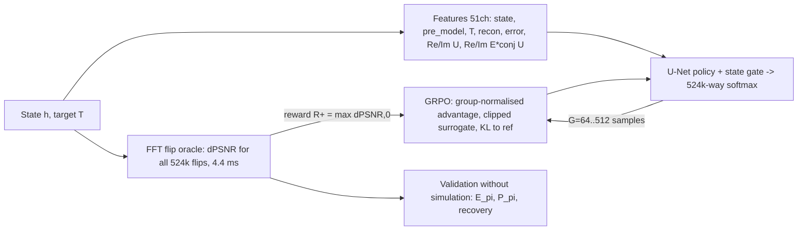

# DBS-GRPO 진행 보고 (랩미팅, 2026-09-11)

연구 질문: **GRPO 로 학습한 정책이 Direct Binary Search(DBS)의 "다음에 뒤집을 픽셀"을 Random DBS 보다 잘 고르는가.**
문제: 8채널 256×256 이진 홀로그램, 픽셀 하나를 뒤집어 ASM 전파(z = 2 mm) 재생상의 PSNR 을 올린다. 행동 공간 524,288, 초기 홀로그램은 사전학습 BinaryNet(U-Net) 출력.

---

## 1. 출발점 (v1, 2026-03)

SB3 PPO 문제를 GRPO 로 직접 재구현한 상태. 에피소드 2,800 까지 학습했으나 평가(검증 100장, 600스텝)에서 +0.0205 → +0.0230 dB 로 평탄. Random 기준선이 없어 승패 판단이 불가했고, 나중에 잰 Random 은 같은 조건에서 ≈ +0.02 dB → **v1 은 Random 과 구분되지 않음.**

못 배운 이유 (진단):

1. 보상이 비싸고 드묾 — 상태 하나에 16개 후보를 각각 시뮬레이션(17회/스텝), 상태 간 배치 없음.
2. 정책이 답을 계산할 재료가 없음 — 관측에 세기만 있고 **위상이 없음**. 3×3 conv 5층(수용 영역 11px)은 PSF 폭(수백 px)에 못 미침.
3. 유효표본이 적음 — 상태당 16표본, 그룹 통계도 그 16개에서.

---

## 2. v2 설계 (2026-09-06)

| 요소 | v1 | v2 |
|---|---|---|
| 스텝 보상 | 16개 후보를 각각 시뮬레이션한 ΔPSNR | **오라클**: 전파가 패딩 격자 위 순환 컨볼루션이라 모든 픽셀의 ΔPSNR 이 FFT 상관 십수 회로 정확히 나옴 (정규화 계수 변화·2차 항 포함, 근사 없음) |
| 관측 | 26ch (state, state_record, pre_model, recon, target) | 51ch: **복소 필드 Re/Im 16 + 오차×켤레필드 16** 추가 |
| 정책 | 3×3 conv 5층 (30만) | 4단 U-Net (780만) + 상태 게이트 (로짓 = h·L1 + (1−h)·L0) |
| 배치 | 이미지 1장, G=16 | 이미지 K=8 동시, G=64→512 |
| 검증 | 없음 | 고정 상태에서 E_π[R⁺], P_π, 회수율을 오라클로 정확히 (시뮬레이션 0회) |
| 상한 | 없음 | 오라클 탐욕 DBS (매 스텝 최선 픽셀) |
| 에피소드 | env.py (max_steps 1만, PSNR 임계, 보너스) | 없음. 1스텝 목적. 고정 스텝 뒤 이미지 교체 |

바꾸지 않은 것: GRPO 의 정의(그룹 z-score 어드밴티지, clipped surrogate ε=0.2, KL k3 β=0.04, 이동 참조), 평가 프로토콜(고정 스텝 DBS, Random 대비), 광학 상수, v1 경로(`trainer="v1"`).

**오라클의 함의**: 학습 목적이 1스텝 ΔPSNR 이라 최적 정책 = 오라클 탐욕. 정책의 가치는 "시험 시 오라클 없이 그 선택을 재현"하는 데 있고, 성적은 오라클 탐욕 대비 회수율로 읽는다. 오라클 지도는 정책 입력에 넣지 않는다.

### 검증 게이트

| 게이트 | 결과 |
|---|---|
| 오라클 대수 (로컬 numpy, 12² 격자 432 플립 전수) | 최대 오차 5e-15 dB |
| 오라클 vs `tt.simulate` (서버, BinaryNet 실제 케이스 24.2 dB, 216 플립) | 최대 오차 1.1e-7 dB, 부호 일치 100%, 스피어만 0.999999, 지도 1회 4.4 ms |
| 지도 통계 (초기 상태) | 개선 픽셀 20.8%, 무작위 실현 이득 2.7e-5 dB, 최선 픽셀 1.44e-3 dB (54배) |
| 스모크 (전 경로) | PASS |

---

## 3. 1차 런 결과 (v2, 24,500 반복, 0.2 s/반복)

학습은 됨: 검증 회수율 0.07(it 50) → 0.21(it 150) → 0.37(it 4,900) → **정체** (it 24,500 도 0.365). 정책은 150 반복 만에 유효 액션 10~40개로 붕괴.

| 평가 (검증 10장) | Random | GRPO it24500 | 오라클 탐욕 |
|---|---|---|---|
| **500 스텝** PSNR↑ | +0.018 (25%) | **+0.152 (80%)**, 10/10 승 | +0.393 |
| **20,000 스텝** PSNR↑ | **+0.637 (22%)** | +0.557 (14%), 2/10 승 (최고 it10000) | +6.360 |

500 스텝에서는 모든 체크포인트(49개)가 Random 을 이겼지만, **2만 스텝에서는 짐.** 정책은 5천 스텝까지 앞서다가 성공률이 9~14% 로 무너짐 — 학습이 채택 200회 이내 상태만 봤기 때문(깊이 불일치). 같은 성공 수에서는 여전히 1.6~1.8배(고른 픽셀의 질은 높음).

### "의미 있는" 국면이란 — Random DBS 예산 곡선

오라클 덕에 Random DBS 를 시뮬레이션 없이 정확히 잴 수 있다(거절은 공짜, 채택만 적용). sweep 변형, 3장, 2패스(105만 시도):

| 상승 | 평균 시도 | 평균 채택 |
|---|---|---|
| +0.5 dB | 1.5만 | 3.3천 |
| +1 dB | 3.3만 | 6.5천 |
| +2 dB | 8.4만 | 1.3만 |
| +3 dB | 17.9만 | 2.1만 |
| 1패스 / 2패스 | +3.6~5.8 / +4.3~6.8 dB | 개선 픽셀 21% → 1% |

→ 의미 있는 상승(+2~3 dB)은 시도 10만~20만, 성공 1만~2만 규모. 종전 학습(≤200 채택)·평가(500 스텝)는 그 1~2%.

---

## 4. 감사와 문헌 (2026-09-07)

하이퍼파라미터 감사(GRPO 원 논문 대조 / 문제 스케일 / 런 진단 / 코드 의미, 반박 검증)와 LLM 밖 GRPO 문헌 조사(DanceGRPO, Flow-GRPO, Mask-GRPO, STAGE, DiffusionNFT, Learning Without Critics(arXiv 2511.03527), U-statistic(2603.01162), Dr.GRPO, DAPO 등).

- 정의(그룹 정규화·클립·KL)는 논문 그대로였고, 어긋난 것은 **체제**: 논문은 lr 1e-6·업데이트 1회로 정책이 π_old 근처에서만 움직이는데, 우리는 반복당 4스텝·lr 3e-4 (KL 4~6 nat, clipfrac 0.3~0.5).
- 1스텝 문제에서 크리틱 없는 GRPO 는 구조적으로 잃는 게 없음(그룹 평균 = V(s) 의 불편 추정, U-statistic 논문: G=32~64 면 오라클 베이스라인에 근접). "작은 G 가 낫다"(Learning Without Critics)는 서로 다른 시작 상태를 섞은 그룹 얘기라 우리(같은 상태 그룹)엔 해당 없음.
- 두 개의 조용한 편차 발견: ratio 클램프 [0,10](문서화 안 된 dual-clip), KL log-ratio 하한 클램프(멀리 간 표본의 KL 기울기 0).

### v2.1 묶음 (승인 후 적용)

G 512 (비용 0), update_epochs 1 + 미니배치 기울기 누적(= DeepSeek μ=1), lr 1e-4, 두 클램프 제거, 새 이미지를 정책으로 0~1.5만 스텝 진행한 뒤 5,000 스텝 학습(배치가 늘 여러 깊이), 검증 = 이미지 2장 × 오라클 탐욕 깊이 (0, 2k, 5k, 10k, 20k) 캐시, 평가 2만 스텝 + 스텝/성공 구간 표.

---

## 5. r2 결과 (v2.1, 40,000 반복)

깊이별 검증(후반 반복): d0 회수율 0.13~0.30 (P_π 90~99%), d2000 0.2~0.5, d5000 0.1~0.4, **d10000 ≈0, d20000 ≈0 (P_π 0%)**. 고갈이 깊으면 확신을 갖고 틀린 픽셀을 고름. 단 d20000(개선 픽셀 0.3%)은 평가가 닿는 깊이(채택 ≤4.4천) 밖.

| 2만 스텝, 검증 10장 | PSNR↑ | 성공률 | Random 이긴 이미지 | 오라클 회수율 |
|---|---|---|---|---|
| Random | +0.635 | 22.0% | — | — |
| **r2 it20000** | **+0.727** | 21.3% | **7/10** | 11.4% |
| r2 it30000 | +0.636 | 18.2% | 7/10 | 10.0% |
| r2 it10000 / it40000 | +0.362 / +0.400 | 11% | 0/10 | 6% |
| 오라클 탐욕 | +6.360 | 100% | — | 100% |

it20000 구간별: 500 스텝 +0.045 (Random +0.018), 2천 +0.130 (+0.071), 5천 +0.258 (+0.175), 1만 +0.438 (+0.333), 2만 +0.727 (+0.635). 같은 성공 수(1천/2천회)에서 +0.198/+0.370 vs Random +0.147/+0.290.

→ **의미 있는 국면에서의 첫 '이김'.** 단 근소(+14%)하고, 선택과 보고가 같은 10장(선택 편향), 시드 1회, 체크포인트 4개 중 2개만 이김, 회수율 11%.

**중요한 관찰**: it40000 은 깊이별 스텝 지표(회수율 0.3, P_π 99%)가 it20000 만큼 좋은데 DBS 성적은 0/10. 스텝 지표가 DBS 성적을 예측하지 못한다.

---

## 6. 찾아서 고친 것 (버그·문제)

| 항목 | 증상 | 처리 |
|---|---|---|
| NaN 크래시 (it 4927~4929) | 기울기에 inf 가 생기면 clip 계수 0 × inf = NaN 이 파라미터로 | 지도·로짓·손실·기울기 노름·파라미터 비유한 검사, 누적 20회면 정지 |
| 재개 가드 | CONFIG 의 튜플이 JSON 에서 리스트로 돌아와 모든 재개가 ValueError | 리스트로 통일, JSON 왕복 표현끼리 비교 |
| 스폰 순서 | 체크포인트 로드 전에 무학습 정책으로 상태 생성 | 학습 시작 시 lazy 스폰 |
| **forward 불일치** | μ=1 인데 43% 반복에서 ratio ≠ 1 (collect 배치 1 vs update 배치 4, 같은 가중치·입력; cudnn 꺼진 native conv 반올림이 증폭) → 클리핑이 무작위 작동 | 첫 epoch 의 old_logp 를 update 의 forward 값으로 앵커, 불일치 크기(`fwdgap`)를 로그 |
| 평가 잡음 바닥 | 오라클 R=+1e-7 인 픽셀을 재계산이 거절 | 채택 하한 1e-6 dB, 거절로 집계 |
| 환경 | 서버 이미지에 gymnasium 없음 | env.py 를 v1 경로에서만 import |

전부 정적 검사(`check_conventions.py`, 101항목)·적대적 코드 검토(다중 에이전트)·서버 스모크로 잡았다.

---

## 7. 현재 상태와 다음

**돌고 있는 것 / 돌릴 것**

- r3: old_logp 앵커 + **학습 중 DBS 판정**(평가와 같은 절차로 2,000 스텝, Random 과 비교, 1,000 반복마다 — 체크포인트 선택 지표) + 스폰 깊이 상한 1만. lr 은 r3 로그의 kl·fwdgap 으로 판정.
- r2 it20000/30000 의 확인 평가: 선택에 안 쓴 report 분할 40장 (약 3시간).

**판정 규칙 (미리 정함)**: 2만 스텝에서 GRPO > Random(같은 시도 수) 이고 회수율 ≥ 30% 면 "의미 있는 국면에서 이김". 유효 액션이 수십 아래로 붕괴하고 깊은 상태 회수율이 낮으면 다음 레버는 탐색(엔트로피 arm). 초기만 되고 깊은 상태만 안 되면 깊이 커리큘럼.

**다음 손잡이 후보** (r3 결과 뒤, 하나씩): 학습 이미지 다양성(지금 2만 반복에 ~40장, K 8→16), 깊이 조건 입력(GroupNorm 이 지우는 전역 스케일을 PSNR 채널로 복원, 스위치), lr.

**솔직히 적어 둘 것**

- 이 구현에서 오라클 탐욕의 스텝당 비용(6.5~7.7 ms)이 정책(5.4~6.6 ms)과 거의 같다. 정책의 가치는 속도가 아니라 "오라클 없이 배웠다"에 있다.
- 결과는 시드 1회·10장이다. 통계적 확인(분할·시드)은 진행 중.
- 정책이 불안정하다(같은 상태의 유효 액션 수가 50 반복 사이 2 ↔ 1만). 원인 후보는 스텝 크기와 데이터 교체 구조.

---

부록: 코드 — `grpo/oracle.py`(오라클), `grpo/oracle_selftest.py`(게이트), `grpo/trainer_v2.py`(배치 GRPO), `grpo/random_dbs_curve.py`(Random 예산), `eval_checkpoints.py`(평가·구간 표), `PLAN.md`(설계·기록·결정), `check_conventions.py`(규약 검사). 서버 순서: `oracle_selftest` → `smoke_v2` → `train_grpo` → `eval_checkpoints`.
